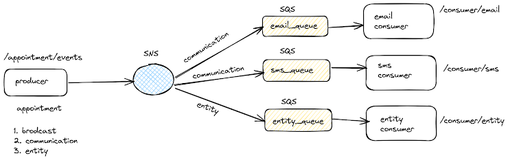

# Appointment System APIs Setup and Testing Guide

This guide provides instructions for setting up and testing the appointment system APIs using Node.js with SNS, SQS, and LocalStack.




## Prerequisites

Before proceeding, ensure you have the following installed:

- Node.js
- Docker
- Postman (for API testing)

## Steps

### Step 1: Start LocalStack

Ensure LocalStack is running with the following command:
```
localstack start
```

### Step 2: Set Up AWS CLI and Environment Variables

#### Configure AWS CLI

Configure AWS CLI to use LocalStack:
```
aws configure --profile localstack
AWS Access Key ID [None]: test
AWS Secret Access Key [None]: test
Default region name [None]: us-east-1
Default output format [None]: json

```


#### Set Environment Variables

Set the following environment variables:

```bash
export AWS_ACCESS_KEY_ID=test
export AWS_SECRET_ACCESS_KEY=test
export AWS_DEFAULT_REGION=us-east-1
export LOCALSTACK_HOSTNAME=localhost
```

### Step 3: Create SNS Topics and SQS Queues

Run `npm install` to install necessary npm packages and libraries

Run the setup script (setup.js is provided in the project):
```bash
node setup.js
```
This script creates the necessary SNS topics and SQS queues and subscribes the queues to the topics.

### Step 4: Start the Server

Run your Node.js server:
```bash
node index.js
```
Your server should now be running on port 3000.

### Step 5: Test the APIs

#### Publish a message

To publish a message using Postman:

- **URL:** `http://localhost:3000/publish`
- **Method:** `POST`
- **Headers:** `Content-Type: application/json`
- **Body:**
  ```json
  {
    "message": "This is a broadcast message",
    "eventType": "broadcast"
  }
  ```
#### Receive Messages

To receive/consume messages from a specific queue, use Postman:

- **URL:** `http://localhost:3000/consume/:queueName`
(Replace `:queueName` with one of `broadcast`, `communication`, or `entity`, depending on the queue you want to consume)
- **Method:** `GET`

Example output:
  ```json
  {
    "messageId": "764a8aff-837c-4f8a-bd93-b72057271476",
    "messageBody": "This is a broadcast message"
  }
  ```


Make sure your server (node index.js) and LocalStack are running when testing these APIs.


